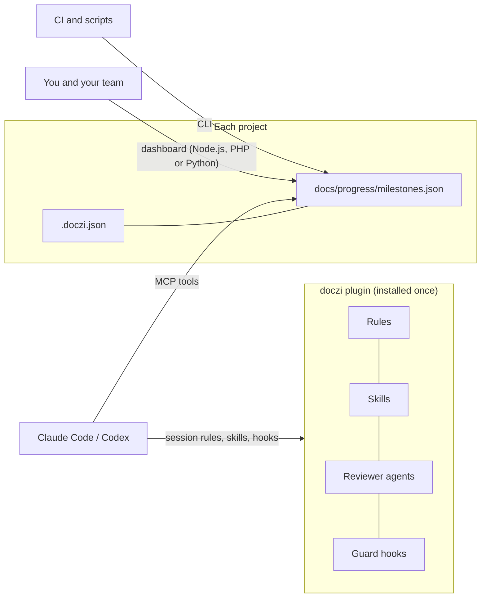

# doczi

**One engineering standard for every project your coding agents touch, and one place to see
where every project stands.**

doczi packages how the work is done (working rules, workflow skills, reviewer agents,
guard rails) and where the work stands (milestones, tasks and steps with progress that computes
itself) into a single plugin for Claude Code and Codex. Install it once; every project gets the
same discipline, and every project's progress is one click away in a shared dashboard.

> Status: v0.1, early release. The progress model, API and dashboard are covered by an
> automated test suite that runs against every supported runtime.

---

## Why doczi

| Without it | With doczi |
| --- | --- |
| Each project re-explains the same rules to its agents, in slightly different words | One rule set, injected at session start, switchable per project |
| Agents jump straight into code | Plan first, test first, smallest diff, and a report of what was not verified |
| "Where are we?" means reading commit logs | Milestone, task and step progress, computed from the real statuses, in a dashboard and in the agent's own context |
| Decisions wait in chat history | Blocked steps carry their reason; open questions sit on the task until someone answers |
| Assistant attribution leaks into code, commits and PRs | Hooks and a git hook keep the work in the project's own voice |
| Requirements live in one tool, progress in another | Each milestone and task links straight to its section of the SRS, plan or ADR |

Built for solo developers and small teams who run several projects with coding agents and want
them to behave like a disciplined senior engineer, consistently.

## How it works



- **Projects keep their data.** A project holds only a small `.doczi.json` and its progress
  file, both in git, reviewable in pull requests next to the code.
- **Three ways in, one source of truth.** Agents use MCP tools, people use the dashboard,
  scripts use the CLI. All of them read and write the same file, under a lock, so no update is
  ever lost.
- **Never in the way.** Plugin skills are namespaced (`/doczi:plan-feature`), so a project's
  own skills keep working, and every rule module can be switched off per project.

## What you get

**Working rules** (injected at session start, per project switchable)
- Read before you claim; plan, then build; test first; smallest correct diff.
- Look up current APIs; say what was not verified.
- Clean code; accessible, responsive UI by default.
- No AI footprint in code, commits or pull requests.
- A lead / secondary-agent model: delegate only bounded work, contract first, always reviewed.
- Two-stage review: the author reviews its own diff first; the lead does the final review,
  with browser end-to-end tests and a look at the running feature for anything with UI.

**Workflow skills**

| Skill | Purpose |
| --- | --- |
| `/doczi:plan-feature` | A reviewed plan with acceptance criteria, test plan and delegation split, before any code |
| `/doczi:implement-task` | Execute an approved plan step by step: test first, verify, keep progress current |
| `/doczi:delegate-task`, `/doczi:review-delegated` | Hand bounded work to a cheaper agent in an isolated worktree, then review it |
| `/doczi:adr` | Architecture Decision Records for invariants, dependencies and contracts |
| `/doczi:commit` | One Conventional Commit, after the project's check passes |
| `/doczi:clean-code`, `/doczi:ui-ux` | Review against the code and UI standards |
| `/doczi:progress`, `/doczi:setup` | Report or update progress; set a project up |
| `/doczi:import-tasks` | Turn an SRS, plan or checklist into milestones, tasks and steps linked to their sections; writes only after you agree |

**Reviewer agents**: `security-reviewer`, `test-writer`, `ux-reviewer`, `perf-reviewer`.

**Guard rails** (hooks that work in both agents)
- Block edits to secrets and generated code (`protect` patterns).
- Block AI tool names and attribution in files, patches, commits, tags and PRs.
- Each edited file is judged by its own project's rules and by the session project's rules.

**Progress tracking**
- Statuses: Done, Waiting for your check, In progress, Blocked (with a reason), Not started.
- Task and milestone statuses are derived, and percentages are always computed, never typed.
- Questions and answers per task. Answers an agent records stay open until you confirm them.
- Document links (SRS, architecture, plans, ADRs) at project, milestone and task level.

**Dashboard** (served by Node.js, PHP or Python; starts with no questions, `--setup` to choose)
- Whole-project bar, and a "Tasks by status" bar with a legend that filters.
- A **Needs you** panel: blocked items with reasons, work waiting for your check, open
  questions.
- Collapsible milestones and tasks, a status menu on every step (with undo), and answers typed
  in place.
- A document reader that renders Markdown and jumps to the linked section.
- Search (`/`), shareable links, light, dark and system themes, phone layout, keyboard and
  screen-reader support.
- **Six interface languages:** English, Persian, Arabic, German, Spanish and Turkish.
  - The page follows the browser's language; a menu in the top bar changes it.
  - Persian and Arabic read right to left.
  - Numbers and dates follow the language. Persian, for example, gets Persian digits and the
    Solar Hijri calendar.
  - The strings are in `web/i18n/<code>.js`. To add a language, add a file there with the same
    keys as `en.js`; a test checks that the keys and placeholders match.

**Optional, pinned upstream plugins** in the same marketplace:
[ui-ux-pro-max](https://github.com/nextlevelbuilder/ui-ux-pro-max-skill) (MIT) for design
intelligence, and
[engineering](https://github.com/anthropics/knowledge-work-plugins/tree/main/engineering)
(Apache-2.0) for standups, incident response, system design and more.

## Quick start

### 1. Access

This repository is private. Give git access once, so the agents can clone it:

```bash
gh auth login
```
```bash
gh auth setup-git
```

### 2. Install the plugin

**Claude Code**

```text
/plugin marketplace add meygh/doczi
/plugin install doczi@doczi
```

Optional: `/plugin install ui-ux-pro-max@doczi` and `/plugin install engineering@doczi`.
The MCP server is included. From a local clone you can also run
`/plugin marketplace add /path/to/doczi`.

**Codex**

```bash
codex plugin marketplace add meygh/doczi
```
```bash
codex plugin add doczi@doczi
```
```bash
codex mcp add doczi -- node /path/to/doczi/mcp/server.mjs
```

Codex asks you to trust the plugin's hooks once. The MCP server is added by path because Codex
does not expand plugin paths in MCP settings.

### 3. Install the command line (dashboard, CLI, git hook)

```bash
npm install -g github:meygh/doczi
```

### 4. Connect a project

```bash
cd your-project
doczi init --check "make check"
```

`init` creates `.doczi.json` and a starter progress file, and registers the project with
the dashboard. It never overwrites existing files. Inside an agent session,
`/doczi:setup` does the same interactively and drafts milestones from your roadmap.

### 5. Daily use

```bash
doczi progress
```
```bash
doczi serve
```

The first start asks nothing: it serves with Node.js (or PHP, or Python 3) on port 4800 and
opens your browser. To choose for yourself, once, run `doczi serve --setup`. The choices are
kept in `~/.doczi/serve.conf` for the next starts. `doczi serve --reset` goes back to the
defaults.

Your agents keep the progress current as they work: steps move to in progress, waiting for your
check or blocked (with a reason), and questions for you land on the task.

## CLI reference

| Command | What it does |
| --- | --- |
| `doczi init [dir]` | Set up a project (`--check`, `--rules`, `--progress`, `--page`, `--no-register`) |
| `doczi progress` | Summary: overall, per milestone, blocked, waiting for your check, open questions, next up |
| `doczi progress --milestone M0` | Every task and step, numbered |
| `doczi progress set M0 "Task" 2 blocked --reason "…"` | Change a step (by name, part of a name, or number) |
| `doczi progress add M1 "Task" "Step"` | Add a step |
| `doczi progress ask M1 "Task" "Question?"` · `answer M1 "Task" 1 "Answer"` | Questions and answers |
| `doczi progress label M1 "Task" --type bug --add ui,api` | Set a task's type and tags (`--type none`, `--remove`, `--tags` replaces) |
| `doczi import docs/SRS.md --milestone M1 [--bullets] [--write]` | Add tasks from a document's headings and checklists (or a JSON plan); previews unless `--write` |
| `doczi export [--format md\|csv\|json] [--out file\|-]` | Write the plan to a new file (never over an existing one), or print it |
| `doczi projects [add <path> \| remove <id>]` | The dashboard's project list |
| `doczi serve [--setup \| --reset] [--runtime node\|php\|python] [--port N] [--no-open]` | Start the dashboard with the saved settings (the defaults the first time, no questions); `--setup` chooses and saves them, `--reset` forgets them, the other flags apply to one run |
| `doczi git-hooks` | Install the commit-msg hook that strips assistant attribution |
| `doczi migrate [dir]` | Move a project set up as solo-keel to doczi (see below) |
| `doczi check-ai [files…]` | Scan files for AI tool or vendor mentions |
| `doczi check-paths [files…] [--staged]` | Scan files for paths of this machine (error) and other absolute paths (warning) |
| `doczi mcp` | Run the MCP server on stdio |

## Configuration: `.doczi.json`

```json
{
  "name": "Shop",
  "check": "make check",
  "progress": "docs/progress/milestones.json",
  "rules": ["core", "clean-code", "no-ai-footprint", "delegation"],
  "aiFootprint": { "check": true, "allow": ["src/providers/"], "terms": [] },
  "protect": [".env", ".env.*", "*.pem", "*.key", "**/secrets/**", "**/gen/**"]
}
```

Every field is optional:
- `rules: false` turns the rule context off, for projects whose own `CLAUDE.md` or `AGENTS.md`
  already says the same.
- `aiFootprint.allow` lists paths that must name AI vendors (for example provider adapters).
- `protect` lists files agents must not edit.

### Settings for one machine: `.doczi.local.json`

A project is often checked out in different places: another drive, another user, another
proxy. Keep what belongs to one machine out of the files you share. `doczi init` adds
`.doczi.local.json` to `.gitignore`; create it next to `.doczi.json`:

```json
{
  "check": "php vendor/bin/phpunit",
  "notes": ["git needs -c safe.directory=<this checkout> here", "the session proxy is the one that works"]
}
```

- `check` replaces the project's check command on this machine.
- `notes` (up to 20 lines of 300 characters) are shown to the agent at the start of every
  session, with the project root on this machine.
- The file is ignored when it is not valid JSON, is larger than 64 KB or is a link.

Shared files must not name this machine's folders. The edit hook blocks text that contains the
project root or the home folder of the machine it runs on, and `doczi check-paths` scans the
tracked files: this machine's paths are errors, any other absolute path (`D:...`,
`/home/<user>/...`) is a warning. `.doczi.json` can switch it off or exempt files:

```json
{ "localPaths": { "check": true, "allow": ["docs/windows-setup.md"] } }
```

`.doczi.local.json` and `*.local.*` files are always exempt. `doczi init` also refuses to run
while the branch it follows already has `.doczi.json` or the progress file that the checkout
lacks (run `git fetch` and `git pull` first), so two people never set the project up twice.

The progress file format, with every status, questions and document links, is described in
[docs/API.md](docs/API.md). Its schema is
[`templates/progress/progress.schema.json`](templates/progress/progress.schema.json).

## Security and privacy

- **Local only.** The dashboard binds to `127.0.0.1`, answers only loopback clients, and
  refuses foreign `Host` headers (DNS rebinding) and cross-site writes.
- **Strict page security.** A strict Content-Security-Policy, and all project text escaped.
- **Bounded file access.** Reads and writes only registered projects' progress files and the
  documents those files link. Every path must stay inside the project after symlinks are
  resolved.
- **Safe writes.** Writes are atomic and made under a lock; symlinked files are refused.
- **Agent context.** Project text that reaches an agent is flattened and labelled as data, not
  instructions. Agents can write only to the current project or registered projects.
- **No dependencies and no network calls.** Nothing phones home.
- **Reviewed.** The release has been through two security reviews, with a regression test for
  every finding.

## Upgrading from solo-keel

doczi was called solo-keel before v0.1. Until v0.3, doczi still reads the old names. When both
exist, the new name wins.

| Before | Now |
| --- | --- |
| `.solo-keel.json` | `.doczi.json` |
| `~/.solo-keel/projects.json` | `~/.doczi/projects.json` |
| `SOLO_KEEL_HOME`, `SOLO_KEEL_PORT`, `SOLO_KEEL_LOCK_TIMEOUT_MS`, `SOLO_KEEL_DEBUG` | `DOCZI_*` |
| `/solo-keel:<skill>`, the `solo-keel` CLI, `meygh/solo-keel` | `/doczi:<skill>`, the `doczi` CLI, `meygh/doczi` |

1. Switch the plugin.
   - Claude Code: run `/plugin marketplace remove solo-keel`, then
     `/plugin marketplace add meygh/doczi`, then `/plugin install doczi@doczi`.
   - Codex: the same steps with `codex plugin marketplace` and `codex plugin add`. Then add the
     MCP server again under the name `doczi`.
2. Reinstall the CLI: run `npm uninstall -g solo-keel`, then `npm install -g github:meygh/doczi`.
3. In each project, run `doczi migrate`.
   - It renames the config file and copies the project list.
   - It refuses if `.doczi.json` already exists.
   - If the project uses the commit-msg hook, run `doczi git-hooks` again.

Until a project is migrated, each agent session starts with a one-line reminder.

## Compatibility

| Component | Requirement |
| --- | --- |
| Plugin, CLI, MCP, hooks | Node.js 20 or newer |
| Dashboard | Any one of Node.js 20+, PHP 8.1+ or Python 3.9+ |
| Agents | Claude Code, Codex |
| Operating systems | Windows, macOS, Linux |

## Roadmap

- **Storage for large and busy projects.** Optional SQLite storage with change history,
  per-milestone JSON files, and export / import. The lock that makes today's JSON storage safe
  with concurrent writers has shipped. Plan: [docs/plans/storage.md](docs/plans/storage.md).
- **Shared progress for teams (v0.3).** One copy of progress on its own git branch, the same
  from every branch and machine, and claims so two people or agents cannot start the same step.
  Plan: [docs/plans/shared-progress.md](docs/plans/shared-progress.md),
  [ADR 0004](docs/adr/0004-shared-progress-branch-and-claims.md).
- **A hosted doczi server (later).** The same store behind a service, for instant claims and a
  live dashboard across projects; the branch stays the default.
- Registering the MCP server automatically on Codex install.
- Editing step titles and notes from the dashboard.
- v0.3: stop reading the legacy solo-keel names ([ADR 0001](docs/adr/0001-rename-to-doczi.md)).

## Development

```bash
npm run check
```

This runs the full test suite (the HTTP contract suite runs against every installed runtime)
and scans the repository for AI mentions. See [AGENTS.md](AGENTS.md) for contribution rules and
[docs/API.md](docs/API.md) for the API contract.

## License

MIT © Meisam Ghanbari. The upstream plugins listed in the marketplace keep their own licenses.
